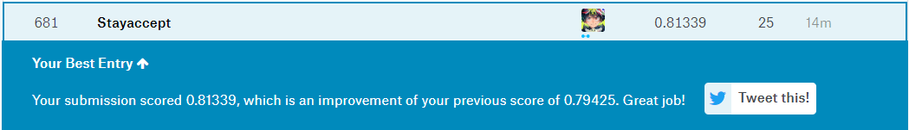

# Score-0.81339-Kaggle-Titanic
Titanic: Machine Learning from Disaster

This is an [kaggle link](https://www.kaggle.com/c/titanic).

## Titanic 2.0.ipynb
### 对Age，Fare，Embarked，Cabin填充了缺失值
### 对Name，Ticket，Parch，Sibsp进行了特征提取
### 模型采用的RF

